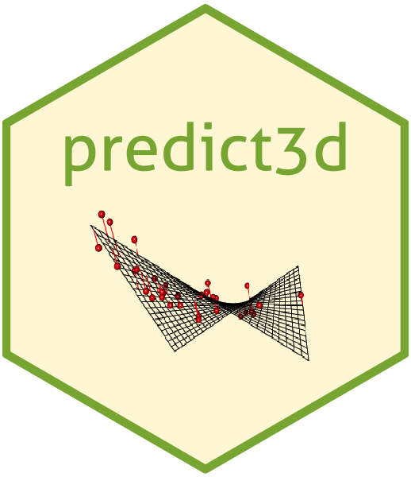
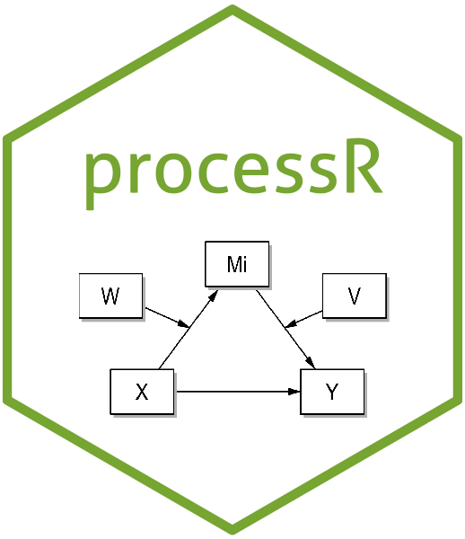

# CRAN Packages by Keon-Woong Moon

### 1. R package mycor

### 2. R package moonBook

### 3. R package ztable

### 4. R package ggiraphExtra

### 5. R package dplyrAssist

### 6. R package editData

### 7. R package ggplotAssist

### 8. R package webr

### 9. R package rrtable

### 10. R package predict3d 

### 11. R package processR 

